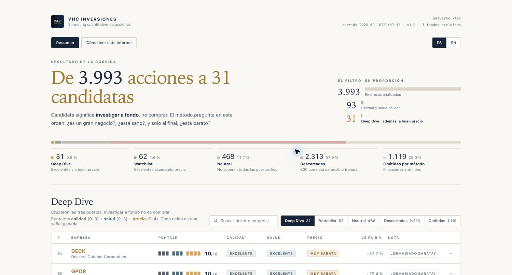

# VHC Inversiones — Screening de Acciones

**Español** · [English](README.en.md)

<p align="center">
  
</p>

Skill multiplataforma para filtrar acciones con exports de InvestingPro y profundizar en reportes Pro Research. El método mantiene siempre este orden:

> **Calidad del negocio → salud financiera → precio**

La versión cuantitativa actual es **v1.0**. El clasificador reduce un universo de empresas a una lista corta para investigar; no decide inversiones por el usuario.

## Contenido

- [Qué hace el skill](#qué-hace-el-skill)
- [Inicio rápido](#inicio-rápido)
- [Instalación](#instalación-en-claude-chatgpt-y-codex)
- [Preparar InvestingPro](#preparar-el-screener-de-investingpro)
- [Analizar más de 1.000 empresas](#analizar-más-de-1000-empresas)
- [De dónde viene el método](#de-dónde-viene-el-método)
- [Todos los indicadores](#todos-los-indicadores)
- [Cómo clasifica](#cómo-funciona-la-clasificación)
- [Uso por tipo de archivo](#cómo-usar-cada-tipo-de-archivo)
- [Archivos generados](#archivos-generados)
- [Ejecución local](#ejecución-local)
- [Solución de problemas](#solución-de-problemas)
- [Licencia](#licencia)

## Qué hace el skill

El skill reconoce tres flujos:

| Archivo adjunto | Flujo | Resultado |
|---|---|---|
| Export `.xlsx` del screener | Screening cuantitativo | Informe en el chat, Excel enriquecido y dashboard HTML |
| Reporte `.pdf` Pro Research de una empresa | Deep Dive cualitativo | Interpretación del reporte, riesgos, verificaciones y preguntas pendientes |
| `.xlsx` y `.pdf` juntos | Análisis combinado | Resultado cuantitativo y Deep Dive cualitativo en bloques separados |
| Sin adjunto | Preguntas sobre el método | Explica columnas, filtros, instalación o acceso a InvestingPro. Para analizar una empresa sí hace falta el archivo |

El PDF **no** genera puntaje ni categoría cuantitativa. Para obtenerlos siempre se necesita el export XLSX y ejecutar el clasificador canónico.

### Dashboard en acción

El dashboard permite consultar los tres tribunales de cada empresa, ver qué mide un indicador, buscar por ticker o nombre, filtrar por categoría y cambiar entre español e inglés.



Demo generada el 16 de septiembre de 2026 a partir de un export de ejemplo de InvestingPro. Las cifras pertenecen a ese archivo: no son datos de mercado actualizados ni una recomendación de inversión. **Deep Dive significa investigar a fondo, no comprar.**

### Qué no hace

- No constituye asesoría financiera ni una recomendación de comprar, vender o mantener.
- No promete retornos.
- No convierte automáticamente una empresa de **Deep Dive** en una compra.
- No usa el PDF para alterar una clasificación obtenida del XLSX.
- No aplica los umbrales cuantitativos a bancos o utilities, porque requieren modelos específicos.
- No te pregunta tu perfil de riesgo, tu horizonte, tu capital ni tu cartera. Esa pregunta solo sirve para adaptar un consejo, así que hacerla ya sería empezar a darlo.
- No analiza una empresa sin el archivo que corresponde, ni de memoria ni con búsqueda web: un resultado así saldría con otros datos y otros umbrales que el del export, y no habría forma de distinguirlo del canónico.
- No lee el export por su cuenta. El resultado cuantitativo sale únicamente de `scripts/screening_acciones.py`, y ningún puntaje, rating o probabilidad se añade encima.

## Inicio rápido

1. Ten acceso a **InvestingPro Pro+**.
2. En el screener, usa la interfaz en inglés.
3. Configura los tres filtros obligatorios y las columnas indicadas en este README.
4. Exporta con **Export → Excel** sin cambiar los encabezados.
5. Adjunta el XLSX al agente que tenga instalado el skill.
6. Envía este mensaje:

   > Te adjunto mi export del screener de InvestingPro. Usa el skill `vhc-inversiones-acciones` y ejecuta el screening completo.

7. Si falta alguna columna núcleo, el script se detiene y dice exactamente cuál debes agregar; no genera resultados incompletos. Con el esquema completo, revisa cualquier aviso de escala y descarga el Excel y el dashboard.

Para un reporte individual:

> Te adjunto un reporte Pro Research en PDF. Usa el skill `vhc-inversiones-acciones` y realiza el Deep Dive cualitativo completo. Separa datos, estimaciones, narrativa de InvestingPro, verificaciones externas e interpretación VHC.

Si el agente no activa el skill automáticamente:

> Usa explícitamente el skill `vhc-inversiones-acciones` para analizar los archivos adjuntos.

## Instalación en Claude, ChatGPT y Codex

El proyecto ofrece dos distribuciones construidas desde las mismas fuentes:

- [`vhc-inversiones-acciones.zip`](vhc-inversiones-acciones.zip), para cargar el skill en Claude, ChatGPT web o instalarlo manualmente en Codex.
- El marketplace incluido en `.agents/plugins/marketplace.json`, para instalarlo como plugin en ChatGPT Desktop y Codex.

Instálalo únicamente si confías en su procedencia: contiene instrucciones, código Python, dependencias declaradas y recursos de marca.

### Claude

#### Si Claude está en español

1. Abre el menú de tu perfil y selecciona **Configuración**.
2. Entra en **Capacidades**.
3. En la sección **Ejecución de código y creación de archivos**, activa **Ejecución de código en la nube y creación de archivos**. Esta capacidad es necesaria para procesar el XLSX y generar el Excel y el dashboard.
4. Es recomendable activar **Permitir salida de red** para que Claude pueda instalar las dependencias declaradas si no están disponibles en su entorno.
5. En la sección **Personalizar**, entra en **Habilidades**.
6. Pulsa **Agregar → Subir una habilidad**.
7. Arrastra `vhc-inversiones-acciones.zip` al cuadro de carga o haz clic para seleccionarlo.
8. Espera el análisis de seguridad y comprueba que la habilidad quede activada.

#### Si Claude está en inglés

1. Abre el menú de tu perfil y selecciona **Settings**.
2. Entra en **Capabilities**.
3. En **Code execution and file creation**, activa **Cloud code execution and file creation**.
4. Es recomendable activar **Allow network egress** para instalar las dependencias declaradas cuando sea necesario.
5. En **Customize**, entra en **Skills**.
6. Pulsa **Add → Upload a skill**.
7. Arrastra `vhc-inversiones-acciones.zip` al cuadro de carga o haz clic para seleccionarlo.
8. Espera el análisis de seguridad y comprueba que el skill quede activado.

En cuentas Team o Enterprise, estas capacidades pueden necesitar la habilitación previa de un administrador.

La ruta oficial puede cambiar con la interfaz; consulta la [guía de Skills de Claude](https://support.claude.com/es/articles/12512180-usar-habilidades-en-claude) si no encuentras alguna opción.

### ChatGPT desde la web

Esta sección corresponde a **ChatGPT abierto desde el navegador**. La aplicación de escritorio puede mostrar una navegación diferente.

#### Si ChatGPT está en español

1. En la barra lateral izquierda, abre **Complementos**.
2. En la parte superior, selecciona la pestaña **Habilidades**.
3. Pulsa el botón **+** situado junto a **Buscar habilidades**.
4. Selecciona **Subir desde tu computadora**.
5. En la ventana **Cargar una habilidad**, arrastra `vhc-inversiones-acciones.zip` al cuadro de carga o haz clic en él para seleccionar el archivo.
6. Espera a que ChatGPT valide la carga y comprueba que **VHC Inversiones — Acciones** aparezca en tu lista de habilidades.
7. Abre un chat nuevo, adjunta el XLSX o PDF y solicita el análisis. Para invocar la habilidad explícitamente, escribe `@vhc-inversiones-acciones` y selecciónala cuando aparezca.

ChatGPT también admite archivos `.skill` o un `SKILL.md`, pero para este proyecto debes cargar el ZIP completo porque el funcionamiento depende de scripts, referencias y assets adicionales.

#### Si ChatGPT está en inglés

Usa el recorrido equivalente: **Plugins → Skills → + → Upload from your computer**. Después carga `vhc-inversiones-acciones.zip` y, si necesitas seleccionarlo manualmente en un chat, usa `@vhc-inversiones-acciones`.

La disponibilidad depende del plan y de los permisos del espacio de trabajo. Si no aparece **Habilidades/Skills** o la opción de carga, el administrador debe habilitar Skills y la carga de skills. Consulta también la documentación oficial de [Skills y Plugins de ChatGPT](https://learn.chatgpt.com/docs/skills-and-plugins).

### ChatGPT Desktop y Codex como plugin

La aplicación de escritorio puede no ofrecer **Subir una habilidad**. En ese caso usa **Agregar marketplace**: el repositorio ya contiene el manifiesto del plugin y su catálogo.

#### Probar la carpeta local antes de publicar

1. Abre **Configuración → Complementos** (*Settings → Plugins*).
2. Pulsa **Agregar → Agregar marketplace** (*Add → Add marketplace*).
3. En **Origen**, selecciona o escribe la carpeta raíz del repositorio, por ejemplo `/ruta/al/repositorio/vhc-inversiones-acciones`.
4. Deja vacías **Referencia de Git** y **Rutas dispersas** para una carpeta local.
5. Pulsa **Agregar marketplace** y reinicia ChatGPT Desktop si el catálogo no aparece inmediatamente.
6. Abre **Explorar directorio**, selecciona **VHC Inversiones** e instala **VHC Inversiones — Acciones** con el botón `+`.
7. Inicia un chat nuevo antes de probar el XLSX o PDF.

#### Instalar desde GitHub después del merge

En el mismo formulario usa:

```text
Origen: git@github.com:corteshvictor/vhc-inversiones-acciones.git
Referencia de Git: main
Rutas dispersas: dejar vacío
```

El repositorio es privado actualmente, por lo que la aplicación debe poder autenticarse con tu clave SSH. Si no puede acceder, usa temporalmente la carpeta local. Agregar el marketplace solo registra el catálogo: después debes abrir **Explorar directorio** e instalar el plugin.

En Codex CLI también puedes registrar el marketplace:

```bash
codex plugin marketplace add git@github.com:corteshvictor/vhc-inversiones-acciones.git --ref main
```

Después abre `/plugins`, selecciona el marketplace **VHC Inversiones**, instala el plugin e inicia una sesión nueva. La extensión IDE de Codex no instala plugins desde el directorio; en ella conserva la instalación manual del skill descrita a continuación.

Consulta la documentación oficial de [plugins en ChatGPT y Codex](https://learn.chatgpt.com/docs/plugins) y de [empaquetado de plugins](https://developers.openai.com/plugins/build/plugins).

### Codex como skill local

Para instalarlo en todos tus proyectos, descomprime el ZIP en la carpeta personal de skills:

```bash
mkdir -p ~/.agents/skills
unzip vhc-inversiones-acciones.zip -d ~/.agents/skills
```

El archivo principal debe quedar en:

```text
~/.agents/skills/vhc-inversiones-acciones/SKILL.md
```

Para habilitarlo solo en un repositorio, usa `.agents/skills` dentro de ese proyecto:

```bash
mkdir -p .agents/skills
unzip /ruta/vhc-inversiones-acciones.zip -d .agents/skills
```

Después inicia una conversación nueva o solicita expresamente usar `$vhc-inversiones-acciones`.

## Preparar el screener de InvestingPro

### Requisito de datos

Se necesita **InvestingPro Pro+**. Los composites Piotroski, Altman y Beneish, además de varias métricas, no están disponibles en el plan básico. El skill no incluye acceso, códigos ni promociones de InvestingPro.

### Los tres filtros obligatorios

1. **Entity type: `Company`.** Evita incorporar ETFs y otros activos.
2. **Region: `United States`.** Los umbrales están calibrados para el mercado estadounidense.
3. **`Primary Trading Item` activado.** Conserva la cotización principal estadounidense y reduce duplicados o emisiones extranjeras.

No filtres por sector. El propio screening aparta financieras y utilities sin perder las plataformas de pago que sí pueden analizarse.

### Reglas de exportación

- Usa InvestingPro en **inglés**.
- Agrega las columnas con el botón `+` y conserva exactamente sus nombres.
- El orden de las columnas no importa: el programa las busca por encabezado. El de las filas sí, si vas a fusionar varias tandas — consérvalas ordenadas por `Market Cap (Adjusted)` de mayor a menor, que es como salen del screener. La herramienta se detiene si encuentra lo contrario.
- No edites ni traduzcas los encabezados después de exportar.
- Exporta a Excel con **Export → Excel**.
- Cada export tiene un límite de 1.000 filas y normalmente queda ordenado por capitalización bursátil. Para analizar más empresas, combina varios exports en una sola hoja bajo una única fila de encabezados: el clasificador acepta hasta 10.000 filas y 10 MiB.
- Adjunta el archivo en el mismo mensaje donde solicitas el screening.

### Analizar más de 1.000 empresas

Cada export corta en 1.000 filas. Para cubrir un universo más ancho se descarga
por tramos y se unen los archivos en una sola hoja. El repositorio trae la
herramienta que los une y, sobre todo, **que comprueba que no se perdió nadie
por el camino**.

**El principio, y es lo único que hay que entender:** cada tanda arranca donde
terminó la anterior. Si el filtro se redondea **hacia arriba**, la última
empresa de una tanda reaparece como primera de la siguiente. Ese duplicado no
estorba —se elimina al fusionar— y es la prueba de que entre las dos no quedó
ningún hueco. Si se redondea hacia abajo, las empresas de ese tramo no entran en
ninguna tanda y **nada en el archivo delata su ausencia**.

**Paso a paso.** Solo se toca un número, y el propio programa lo calcula:

1. Exporta **sin filtros**. Salen las 1.000 mayores.
2. Une lo descargado:

```bash
cd /ruta/a/vhc-inversiones-acciones
python tools/merge_exports.py ~/Downloads/Untitled*.xlsx
```

Dos detalles que ahorran un rato de pelea con la terminal: el comando sale de la
**raíz del repositorio**, porque la herramienta vive en `tools/`; y acepta tanto
la lista de archivos que expande la terminal como un comodín entre comillas
—`"~/Downloads/Untitled Screener*.xlsx"`—, que es lo que hace falta cuando los
nombres llevan espacios antes del asterisco.

El resultado queda junto a los exports, en `universe.xlsx`. Con `-o` se escribe
en otro sitio.

La herramienta lee archivos que descargaste tú y **no hace la inspección previa
del archivo ni aplica los límites de recursos del clasificador**: ni tamaño
máximo, ni tope de entradas del ZIP, ni de contenido descomprimido. Sí hereda de
`openpyxl` la defensa contra XML malicioso, porque esa biblioteca usa
`defusedxml`. Trabaja sobre exports auténticos de InvestingPro, que es para lo
que está pensada. No la apuntes a un `.xlsx` que llegó de un tercero — para eso
está el skill, que sí inspecciona antes de abrir.

3. Al final de su salida, en `SIGUIENTE TANDA`, aparecen las cuatro casillas que
   hay que rellenar: columna, comparador, número y unidad. Cópialas al filtro y
   exporta otra vez.
4. Vuelve al paso 2. Cuando el número que proponga baje del tamaño que te
   interesa —100 M, por ejemplo—, has terminado: deja de descargar. No hace
   falta ningún filtro de piso.

Cuando una tanda traiga menos de 1.000 filas, el programa lo dice y el universo
está completo.

La herramienta ordena las tandas por capitalización, revisa frontera por
frontera, elimina los duplicados y escribe una hoja única con una sola fila de
encabezados. Termina con `Sin huecos` cuando todo encaja. Si falta un solape,
nombra el tramo perdido y da el filtro exacto para recuperarlo, tanto para la
web como para la API.

**Tres avisos que ahorran una descarga perdida:**

- **Descarga todas las tandas el mismo día.** Las capitalizaciones cambian con
  el precio, y mezclar fechas rompe las fronteras.
- **Usa un directorio limpio.** El comodín recoge todo lo que coincida, así que
  un export viejo se cuela y estropea el resultado.
- **Redondea siempre hacia arriba.** Un duplicado sobra y se ve; un hueco no
  deja rastro.

**No hace falta bajar hasta el fondo del mercado.** En el universo medido el 25
de agosto de 2026 —8.723 empresas de EE. UU.— ninguna por debajo de 292 M de
capitalización llegó a Deep Dive ni a Watchlist: el método pide ROIC alto
sostenido cinco años, y por debajo de esa talla rara vez hay datos completos o
analistas que cubran la empresa. Con un piso de 100 M el universo baja a unas
3.800 y aquella corrida no perdió ningún candidato.

Es una observación fechada, no una garantía. El mercado se mueve y una empresa
pequeña puede calificar en otra corrida, así que conviene rehacer la medición
antes de fiarse del piso. El razonamiento —que el método pide una trayectoria
que rara vez existe a esa escala— envejece mejor que el número.

### Resumen de columnas

| Grupo | Cantidad | Consecuencia si falta |
|---|---:|---|
| Esenciales | 3 | El screening se detiene |
| Núcleo | 17 | El screening se detiene antes de clasificar y no genera archivos |
| Opcionales | 5 | El análisis se genera; se pierde contexto, ordenación o enlaces |

## De dónde viene el método

Ninguno de los seis modelos que usa el clasificador es invención de este
proyecto: todos proceden de trabajos publicados y siguen siendo de sus autores.
Y la forma de combinarlos tampoco nació aquí — de dónde viene está en el
[reconocimiento](#reconocimiento), unas líneas más abajo. Lo que hace la versión
1.0 es implementar esa combinación y dejar cada umbral escrito junto a su
fuente, para que se pueda discutir contra ella en vez de aceptarlo porque sí.

| Modelo | Origen | Qué mide aquí |
|---|---|---|
| **Greenblatt** | Joel Greenblatt, *The Little Book That Beats the Market*, Wiley, 2005 | Rendimiento sobre el capital invertido: `ROIC` actual y su promedio a cinco años |
| **MSCI** | Metodología de los índices de calidad de MSCI | `ROE` alto acompañado de un apalancamiento sano |
| **AQR** | Asness, Frazzini y Pedersen, *Quality Minus Junk*, Review of Accounting Studies 24(1), 2019, pp. 34–112 — [doi](https://doi.org/10.1007/s11142-018-9470-2) | Cuatro pilares: rentable, que crece, segura y que devuelve capital |
| **Piotroski** | Joseph Piotroski, *Value Investing: The Use of Historical Financial Statement Information to Separate Winners from Losers*, Journal of Accounting Research 38, 2000, pp. 1–41 — [doi](https://doi.org/10.2307/2672906) | El F-Score de nueve criterios sobre la solidez contable |
| **Altman** | Edward Altman, *Financial Ratios, Discriminant Analysis and the Prediction of Corporate Bankruptcy*, The Journal of Finance 23(4), 1968, pp. 589–609 — [doi](https://doi.org/10.1111/j.1540-6261.1968.tb00843.x) | La Z-Score, distancia a la quiebra |
| **Beneish** | Messod Beneish, *The Detection of Earnings Manipulation*, Financial Analysts Journal 55(5), 1999, pp. 24–36 — [doi](https://doi.org/10.2469/faj.v55.n5.2296) | El M-Score, patrones compatibles con manipulación contable |

Cada enlace es un **DOI**: un identificador permanente que resuelve siempre a la
página de la editorial. No apuntan a agregadores ni a copias sueltas, que
cambian de sitio o desaparecen. El trabajo de Greenblatt es un libro y no
tiene DOI; MSCI publica su metodología de índices en su propio sitio.

Los tres primeros forman la puerta de **calidad** —una lente cada uno, y hacen
falta las tres para que una empresa sea EXCELENTE—. Los tres últimos forman la
de **salud financiera**. El **precio** no usa ningún modelo académico: suma
señales a favor y en contra de `EV / EBIT`, el rendimiento del flujo de caja
libre, el descuento frente al fair value y la etiqueta de los analistas.

### Reconocimiento

Este proyecto nació usando el skill de screening que **Aprende a Invertir**
publica en su web, y del que tomó el orden del método —calidad, salud, precio—,
la exclusión sectorial de financieras y utilities, y la idea de las cinco
categorías. Puede descargarse [aquí](https://aprendeainvertir.notion.site/Skill-Screening-Aprende-a-Invertir-3a7a6dd342358159be26ca80b9eb472e).

El código de este repositorio es una reimplementación escrita para VHC
Inversiones: arquitectura modular, pruebas con cobertura completa, salida
bilingüe, distribución para Claude, ChatGPT y Codex, la ruta cualitativa de
reportes PDF y las herramientas de `tools/`. Los seis modelos de la tabla de
arriba proceden de trabajos publicados y son de sus autores; el mérito de
haberlos articulado en el método que inspiró este proyecto, y de haberlo
enseñado, es de Aprende a Invertir.

Los umbrales exactos de cada uno están en las tablas de abajo, y son los de la
versión 1.0 del método. Cambiarlos cambia la clasificación, así que
`SCREENING_VERSION` se mueve con ellos.

## Todos los indicadores

Los nombres siguientes deben coincidir exactamente con el export en inglés. La columna “Uso en el método” describe el comportamiento real de la versión 1.0.

### 1. Identificación — esenciales

| Columna exacta | Qué mide | Uso en el método |
|---|---|---|
| `Name` | El nombre de la empresa. | Identifica cada fila y permite detectar nombres que parecen fondos o ETFs. Es obligatoria. |
| `Ticker` | El símbolo de la acción, por ejemplo `AAPL`. | Identifica, ordena y cruza la empresa con la exclusión sectorial. Es obligatoria. |
| `Price, Current` | El precio actual de la acción. | Permite calcular el potencial frente al `Fair Value`. Es obligatoria, aunque una celda individual ausente se trata como `N/D`. |

`Full Ticker` aparece junto a la identificación en la guía visual porque completa el enlace de cada empresa, pero técnicamente es opcional y se explica al final.

### 2. Calidad del negocio — núcleo

Estas ocho columnas alimentan los marcos de Greenblatt, MSCI y AQR.

| Columna exacta | Qué mide | Uso y umbrales en v1.0 |
|---|---|---|
| `Return on Invested Capital` | Cuánto rinde la empresa sobre el capital que invierte. | Junto con el promedio de 5 años forma el lente Greenblatt. Ambos en `≥ 20%` producen **Sí**; cualquiera en `< 10%` produce **No** y se marca como riesgo. Entre ambos niveles produce **Medio**. |
| `Avg Return on Invested Capital (5y)` | El promedio del rendimiento sobre capital en cinco años; sirve como señal de persistencia o *moat*. | Usa los mismos umbrales del ROIC actual. Si el ROIC actual cae por debajo de este promedio, el informe pide revisar el *moat*. |
| `Return on Equity` | La rentabilidad sobre el patrimonio. | Es la base del lente MSCI: `≥ 15%` con apalancamiento sano produce **Sí**; `< 10%` o una deuda excesiva produce **No**. También aporta al pilar de rentabilidad AQR. |
| `Gross Profit Margin` | El margen de ganancia bruta. | Un valor `≥ 40%` aporta una señal al pilar de rentabilidad de AQR. |
| `Avg EPS Growth (5y)` | El crecimiento promedio de las utilidades por acción en cinco años. | Junto con ingresos forma el pilar de crecimiento AQR. Ambos positivos son favorables; cualquiera negativo es desfavorable; cero es informativo. |
| `Revenue CAGR (5y)` | El crecimiento anual compuesto de los ingresos en cinco años. | Se evalúa junto con el crecimiento de EPS bajo las mismas reglas del pilar de crecimiento AQR. |
| `FCF / Net Income` | Qué proporción de la utilidad se convierte en flujo de caja libre real. | Una relación `≥ 0,8`, acompañada de `Free Cash Flow Yield > 0`, cuenta como conversión favorable dentro del pilar de rentabilidad AQR. Una conversión inferior se marca para revisión. |
| `Buyback Yield` | Cuánto recompra la empresa de sus propias acciones. | Es el pilar de distribución AQR: `≥ 0%` es favorable; `< -2%` es desfavorable; entre `-2%` y `0%` es informativo. Un dato negativo suele reflejar emisión neta o dilución. |

#### Lente Greenblatt

- **Sí:** ROIC actual y ROIC promedio de cinco años son `≥ 20%`.
- **No:** cualquiera es `< 10%`.
- **Medio:** los demás casos.
- Si solo existe uno de los datos, `< 10%` da **No** y el resto **Medio**.
- Si faltan ambos, el lente queda `N/D`.

#### Lente MSCI

- **Sí:** ROE `≥ 15%` sin apalancamiento excesivo.
- **No:** ROE `< 10%` o deuda/capital `> 60%`.
- **Medio:** los demás casos.
- Si falta deuda/capital, un Altman `< 1,81` se usa como evidencia de apalancamiento riesgoso.
- Si falta ROE, el lente queda `N/D`.

#### Lente AQR

AQR reúne cuatro pilares:

1. **Rentabilidad:** es favorable cuando se cumplen al menos dos de estas tres señales: ROE `≥ 15%`, margen bruto `≥ 40%` y conversión `FCF / Net Income ≥ 0,8` con FCF Yield positivo.
2. **Crecimiento:** EPS e ingresos positivos son favorables; una tasa negativa es desfavorable; cero es informativo.
3. **Seguridad:** Altman `≥ 3` es favorable; `< 1,81` es desfavorable; entre `1,81` y `3` solo es favorable si `Overall Health Label` es `good`, `great` o `excellent`.
4. **Distribución:** Buyback Yield `≥ 0%` es favorable; `< -2%` es desfavorable; el intervalo restante es informativo.

El lente AQR da **Sí** con al menos tres pilares favorables y ninguno desfavorable; da **No** con al menos dos desfavorables; los demás casos quedan en **Medio**.

#### Veredicto de calidad

| Lentes en “Sí” | Veredicto |
|---:|---|
| 3 | `EXCELENTE` |
| 2 | `BUENA` |
| 0 o 1 | `DÉBIL` |

La calidad es la puerta principal: sin calidad `EXCELENTE` no se puede entrar en Deep Dive ni Watchlist.

### 3. Salud financiera — núcleo

| Columna exacta | Qué mide | Uso y umbrales en v1.0 |
|---|---|---|
| `Piotroski Score` | La solidez financiera en una escala de 0 a 9. | `≥ 7` aporta una de las tres señales de salud. `≤ 3` se marca en rojo y puede activar una alerta de mejora débil. |
| `Altman Z-Score` | El riesgo estadístico de quiebra. | `≥ 3` aporta una señal; entre `1,81` y `3` es zona gris; `< 1,81` es zona de riesgo y fuerza salud `DÉBIL`. |
| `Beneish M-Score` | Detecta indicios de posible manipulación de resultados. | `≤ -1,78` aporta una señal de salud. `> -1,78` genera una alerta ámbar; no demuestra manipulación, solo exige revisión. |
| `Total Debt / Total Capital` | El nivel de endeudamiento de la empresa. | Más de `60%` invalida el lente MSCI. No suma directamente al conteo de tres señales de salud. |
| `Overall Health Label` | La etiqueta general de salud financiera de InvestingPro. | Sirve como apoyo del pilar de seguridad AQR cuando Altman está entre `1,81` y `3`. No suma directamente al conteo de salud. |

El tribunal de salud cuenta tres señales: Piotroski `≥ 7`, Altman `≥ 3` y Beneish `≤ -1,78`.

| Señales de salud | Veredicto |
|---:|---|
| 3 | `EXCELENTE` |
| 2 | `MIXTA` |
| 0 o 1 | `DÉBIL` |

Altman `< 1,81` produce salud `DÉBIL` aunque existan otras señales. La salud débil bloquea Deep Dive y Watchlist.

### 4. Precio — núcleo

| Columna exacta | Qué mide | Uso y umbrales en v1.0 |
|---|---|---|
| `Fair Value` | El valor justo estimado de la acción. | Se compara con `Price, Current`. Un potencial `≥ 20%` cuenta a favor; `≤ -10%` cuenta en contra. Un potencial `≥ 40%` en una empresa excelente activa “¿Demasiado barata?” para exigir revisión. |
| `Fair Value Label (Analyst Targets)` | La etiqueta de valoración según objetivos de analistas. | `bargain` o `undervalued` cuenta a favor; `overvalued` cuenta en contra. El método usa esta etiqueta, no `Fair Value Label` de los modelos de InvestingPro. |
| `EV / EBIT` | Cuántas veces las ganancias operativas vale la empresa. | Un valor positivo `≤ 10` cuenta a favor; `≥ 20` o negativo cuenta en contra. |
| `Free Cash Flow Yield` | El flujo de caja libre frente al precio de la acción. | `≥ 4%` cuenta a favor; `≤ 2%` cuenta en contra. También interviene en la señal de conversión de caja AQR. |

La fórmula del potencial frente al valor justo es:

```text
(Fair Value - Price, Current) / Price, Current
```

El tribunal suma cuatro posibles señales favorables y cuatro contrarias. Su veredicto neto es:

| Condición | Veredicto |
|---|---|
| 3 o 4 favorables y más favorables que contrarias | `MUY BARATA` |
| 2 favorables y más favorables que contrarias | `BARATA` |
| 2 o más contrarias y más contrarias que favorables | `CARA` |
| Cualquier otro caso, incluido un empate | `MIXTA` |

### 5. Contexto — opcionales

Estas columnas enriquecen el resultado, pero no cambian la clasificación cuantitativa.

| Columna exacta | Qué mide | Uso en el informe |
|---|---|---|
| `Full Ticker` | El símbolo con su bolsa, por ejemplo `NASDAQGS:AAPL`. | Enlaza cada empresa del dashboard con su ficha de InvestingPro. Sin ella el informe funciona, pero los tickers no tendrán enlace. |
| `Market Cap (Adjusted)` | El tamaño de la empresa por capitalización bursátil. | Se muestra en el Excel y ordena el Watchlist de mayor a menor capitalización. |
| `P/E Ratio` | La relación entre precio y utilidad. | Se muestra como contexto de valoración; no suma ni resta señales. |
| `PEG Ratio Fwd` | El P/E ajustado por el crecimiento esperado. | Se muestra como contexto; no suma ni resta señales. |
| `Beta (5 Year)` | La volatilidad frente al mercado durante cinco años. | Se muestra como contexto de riesgo; no suma ni resta señales. |

La guía visual original agrupa `P/E Ratio` y `PEG Ratio Fwd` bajo Precio, pero el clasificador v1.0 los trata como opcionales. Esa distinción evita creer que afectan el veredicto.

### Columnas extra

El export puede contener otras columnas y el screening las ignorará sin problema. En particular:

- `Fair Value Label` no sustituye a `Fair Value Label (Analyst Targets)`.
- `Fair Value (Analyst Target)` puede venir restringida y no se usa.

### Escala de los porcentajes

InvestingPro exporta los porcentajes como decimales; por ejemplo, `0.478` representa `47,8%`. El programa hace la conversión automáticamente. Si detecta que la escala parece haber cambiado, detente y no uses los resultados hasta confirmarlo: los umbrales podrían quedar descalibrados por un factor de 100.

## Cómo funciona la clasificación

### Puntaje de 0 a 10

```text
Puntaje = lentes de calidad en Sí (0–3)
        + señales favorables de precio (0–4)
        + señales de salud (0–3)
```

El puntaje resume señales, pero **no determina por sí solo la categoría**. Las puertas de calidad y salud siguen siendo obligatorias.

### Categorías finales

| Categoría | Regla | Interpretación correcta |
|---|---|---|
| `Deep Dive` | Calidad `EXCELENTE`, salud distinta de `DÉBIL` y precio `BARATA` o `MUY BARATA` | Merece investigación profunda; no significa comprar |
| `Watchlist` | Calidad `EXCELENTE`, salud distinta de `DÉBIL`, pero precio no atractivo | Empresa excelente que espera mejor precio |
| `Neutral` | Calidad `BUENA`, o calidad `EXCELENTE` que no supera la puerta de salud | Hoy no supera todas las puertas |
| `Descartada` | Calidad `DÉBIL` o datos insuficientes | No cumple el método hoy; no es un pronóstico de precio |

Una fila queda marcada con **Datos insuficientes** cuando faltan al menos cinco de doce datos centrales: ROIC actual, ROIC 5 años, ROE, margen bruto, crecimiento de EPS, crecimiento de ingresos, FCF/Net Income, Buyback Yield, EV/EBIT, FCF Yield, Fair Value y Piotroski.

### Alertas

El informe puede mostrar hasta tres alertas por empresa, priorizadas por severidad:

- `Datos insuficientes`.
- `Altman zona de riesgo` cuando Altman `< 1,81`.
- `M-Score` cuando Beneish `> -1,78`.
- `Posible trampa de valor` cuando el precio parece atractivo pero la calidad es débil.
- `Excelente pero salud débil`.
- `¿Demasiado barata?` para una empresa excelente con potencial `≥ 40%` o al menos tres señales favorables de precio.
- `Mejora débil` cuando una empresa excelente tiene Piotroski `≤ 3`.

Las alertas son preguntas de investigación, no conclusiones automáticas.

### Fondos, financieras y utilities

- Los fondos y ETFs se excluyen de la clasificación de empresas.
- Las financieras y utilities incluidas en [`references/sectores_excluidos.csv`](references/sectores_excluidos.csv) aparecen como **Omitida por método**.
- En un banco la deuda forma parte de la materia prima del negocio y en una utility el retorno suele estar regulado; umbrales como Altman o ROIC pueden castigarlos injustamente.
- Las plataformas de pagos de la lista blanca sí se analizan normalmente: Visa, Mastercard, PayPal, Fiserv, FIS, Global Payments, Jack Henry, WEX, Corpay, Toast, Block y Shift4, incluidos los tickers alternativos definidos en el CSV.

No copies el script aislado. Si falta el CSV sectorial, la ejecución se detiene para evitar una clasificación inválida.

## Qué modelo usar

| | Claude | ChatGPT |
|---|---|---|
| **Mínimo** | Sonnet 5, esfuerzo medio | Luna 5.6, esfuerzo medio |
| **Recomendado** | Sonnet 5 en alto o superior, u Opus 5 en medio o superior | Luna, Tierra o Sol en alto o superior |
| **No usar** | Haiku 4.5 | — |

El mínimo vale para todo el skill. Con Haiku 4.5 una de cada tres respuestas de Deep Dive abandonó
el método —puntajes propios, probabilidades y veredictos de compra—, así que no se recomienda para
nada aquí. Sonnet 5 está disponible en la cuenta gratuita.

**Sobre qué está probado y qué no.** El código lleva 214 pruebas automáticas con cobertura
completa, en Linux, macOS y Windows: acreditan que el clasificador calcula lo que debe y que el
paquete se reconstruye idéntico. Lo que no acreditan es que un modelo obedezca las reglas del
skill, porque eso no se comprueba con una prueba automática sino abriendo el chat y mirando la
respuesta. Esa matriz manual existe —está en [`tests/evals/`](tests/evals/)— y **la versión
publicada no ha pasado por ella**. Los umbrales de arriba salen de haberla corrido sobre versiones
anteriores. Si encuentras una respuesta que se salta el método, abre un issue: es la forma más
útil de mejorar esto.

En ChatGPT el script necesita `defusedxml`, `openpyxl` y `Pillow`, declaradas en el
`requirements.txt` del paquete: las instala el propio agente al ejecutar la Ruta A. Si un análisis
falla al arrancar, ahí es donde hay que mirar.

Las pruebas que respaldan esta tabla —dos plataformas, 38 ejecuciones— están en
[`tests/evals/RESULTADOS.md`](tests/evals/RESULTADOS.md).

## Cómo usar cada tipo de archivo

### A. Screening con XLSX

1. Adjunta el export sin modificar.
2. Pide ejecutar el screening completo con `vhc-inversiones-acciones`.
3. Lee primero cualquier aviso de columnas faltantes o escala sospechosa.
4. Revisa el embudo y las categorías.
5. Abre el Excel para inspeccionar todos los datos y señales.
6. Abre el dashboard para recorrer las cinco categorías, buscar una empresa en cualquiera de ellas, consultar qué mide cada indicador y leer la explicación de los tribunales. Cámbialo a inglés con el selector `ES | EN` si lo compartes fuera.
7. Investiga cualitativamente las candidatas; no tomes la categoría como una orden.

El agente debe obtener puntajes, señales, veredictos, alertas y categorías únicamente de `scripts/screening_acciones.py`. No debe recalcularlos manualmente.

### B. Deep Dive con PDF Pro Research

El PDF debe ser un reporte Pro Research de una empresa individual. El agente debe leer todas las páginas, incluidas tablas, gráficos, notas y el *disclaimer*, y registrar empresa, ticker, bolsa, fecha, precio de referencia, moneda, periodo fiscal y alcance.

La respuesta separa cinco capas:

1. Datos históricos reportados.
2. Estimaciones, *fair values*, objetivos y *guidance*.
3. Narrativa de InvestingPro, como Pro Tips, SWOT o bull/bear case.
4. Verificaciones externas, preferiblemente fuentes primarias.
5. Interpretación VHC.

El análisis recorre calidad, salud y precio, y entrega:

1. Ficha del reporte.
2. Lectura ejecutiva.
3. Calidad del negocio.
4. Salud financiera.
5. Precio.
6. Catalizadores y riesgos.
7. Contraste de fuentes.
8. Preguntas pendientes.
9. Conclusión educativa.

Los datos de mercado son vigentes solo a la fecha del PDF, salvo verificación posterior. El reporte no produce categoría ni puntaje VHC por sí solo.

La guía canónica completa está en [`references/DEEP_DIVE_PDF.md`](references/DEEP_DIVE_PDF.md).

### C. XLSX y PDF juntos

1. El agente ejecuta primero el screening cuantitativo del XLSX.
2. Localiza la empresa del PDF por ticker.
3. Presenta por separado el resultado cuantitativo y el Deep Dive cualitativo.
4. Si existe una contradicción, conserva la clasificación canónica y registra la diferencia como asunto pendiente.
5. Si el ticker no aparece en el XLSX, lo informa y no inventa una categoría.

Prompt recomendado:

> Usa `vhc-inversiones-acciones` con ambos adjuntos. Ejecuta primero el screening del XLSX, localiza la empresa del PDF por ticker y después realiza el Deep Dive. Mantén separados el resultado cuantitativo y la evidencia cualitativa; no reclasifiques manualmente.

## Archivos generados

Una corrida XLSX completa entrega:

1. **Informe ejecutivo en el chat o terminal:** fecha, versión, embudo, conteos, lista Deep Dive, alertas y rutas de salida.
2. **`Screening_VHC_<fecha_hora>.xlsx`:** libro enriquecido con categorías, puntaje, tribunales, señales, métricas, alertas, colores, comentarios explicativos y una hoja “Cómo leer”.
3. **`Dashboard_VHC_<fecha_hora>.html`:** dashboard interactivo y autocontenido. Incluye el embudo, la distribución de las cinco categorías y filtros que abren Deep Dive, Watchlist, Neutral, Descartadas y Omitidas por método; el detalle de los tres tribunales en Deep Dive y Watchlist; y enlaces a InvestingPro cuando existe `Full Ticker`.

   El **buscador recorre las cinco categorías a la vez**: si la empresa está en otra, te dice en cuál y te lleva. Cada indicador —ROIC, Altman Z, EV/EBIT y el resto— abre su definición al pulsarlo, con el umbral que le aplica el método; el **glosario completo de los 17** está en la guía “Cómo leer este informe”, junto al diagrama de las tres puertas, y desde ahí se imprime a PDF.

   El selector **`ES | EN`** traduce toda la interfaz, incluidos veredictos, alertas y formato numérico. El motor sigue emitiendo español: la traducción vive solo en la capa de presentación, así que la clasificación no cambia.

### Idioma del informe

El informe, el Excel y el dashboard salen **en español por defecto**. Para obtenerlos en inglés hay que **pedirlo explícitamente**: escribir el mensaje en inglés no basta, porque mucha gente escribe en inglés y quiere el resultado en español.

> Ejecuta el screening y entrégame el informe en inglés.

En ejecución local es la opción `--lang en`. El dashboard abre en el idioma pedido y su selector `ES | EN` sigue funcionando, así que ese archivo se puede cambiar sin regenerar nada. El Excel no tiene selector: si lo quieres en el otro idioma, hay que volver a ejecutar.

El idioma **nunca** altera la clasificación: el motor solo emite español y la traducción vive en la capa de presentación.

**Los nombres de columna de InvestingPro se quedan en inglés**, en los dos idiomas. Son los mismos `Return on Invested Capital`, `EV / EBIT` o `Piotroski Score` que configuraste en el screener: traducirlos rompería la trazabilidad entre lo que pediste allí y lo que ves en el Excel. Lo que sí se traduce son las columnas que calcula el método —`Balde`, `Puntaje`, los veredictos, las señales y las alertas— y toda la hoja de guía. Qué mide cada indicador está en el glosario del dashboard, en ambos idiomas.

#### Cómo pedirlo

Para español no hace falta decir nada. Es el prompt normal, escribas en el idioma que escribas:

> Te adjunto mi export del screener de InvestingPro. Usa el skill `vhc-inversiones-acciones` y ejecuta el screening completo.

> I am attaching my InvestingPro screener export. Use the `vhc-inversiones-acciones` skill and run the full screening.

**Los dos entregan los archivos en español.** El segundo es el caso que más se confunde: escribir en inglés no pide archivos en inglés, y por eso el agente te responderá en inglés pero el Excel saldrá en español.

Para inglés hay que decirlo:

> Te adjunto mi export del screener de InvestingPro. Usa el skill `vhc-inversiones-acciones`, ejecuta el screening completo y entrégame el informe, el Excel y el dashboard en inglés.

> I am attaching my InvestingPro screener export. Use the `vhc-inversiones-acciones` skill, run the full screening and deliver the report, the Excel file and the dashboard in English.

Cómo seleccionarlo antes de escribir, según dónde estés. En todos los casos escribes el prefijo, filtras y **eliges «VHC Inversiones — Acciones» de la lista**: no es un comando que se envíe tal cual.

| Dónde | `/vhc` | `@vhc` |
|---|:---:|:---:|
| Claude, pestaña **Inicio** (Chat y Cowork) | sí | no |
| Claude, pestaña **Code** | no | no |
| ChatGPT, modo **Chat** | no | sí |
| ChatGPT, modo **Work** | sí | sí |
| Codex, dentro de la app de ChatGPT | sí | sí |

Esa tabla sale de probarlo en las apps de macOS. Fuera de ellas valen las formas documentadas: `@vhc-inversiones-acciones` en ChatGPT web y `$vhc-inversiones-acciones` en Codex CLI. **Nombrarlo en el mensaje funciona en todas, siempre que el skill esté instalado y activado**: «Usa el skill `vhc-inversiones-acciones`…». Si la interfaz cambia y el selector deja de aparecer, esa es la vía que no falla.

Y un aviso que ahorra un rato de confusión: la pestaña **Code** es Claude Code, que **no hereda** las habilidades cargadas en Personalizar. El ZIP hay que descomprimirlo también en su propia carpeta.

```bash
mkdir -p ~/.claude/skills
unzip vhc-inversiones-acciones.zip -d ~/.claude/skills
```

Para habilitarlo solo en un repositorio, usa `.claude/skills` dentro del proyecto. Después reinicia la sesión y aparecerá con la barra.

La barra abre un buscador, no es un comando: filtras y seleccionas.

Adjuntas el archivo y ya está: al seleccionarlo no hace falta volver a nombrarlo dentro del mensaje.

Pero eso **no sustituye al prompt**. Seleccionar el skill dice qué herramienta usar, no en qué idioma quieres los archivos. Si los quieres en inglés, tiene que estar escrito en el mensaje.


El timestamp incluye segundos y un sufijo de colisión cuando hace falta, por lo que dos corridas no sobrescriben silenciosamente los archivos anteriores.

Los archivos se guardan en `outputs/` de forma predeterminada o en la carpeta indicada con `--outdir`.

### Cómo interpretar los colores

- Verde: señal favorable o categoría de mayor interés metodológico.
- Ámbar: zona mixta, informativa o que requiere revisión.
- Rojo: riesgo, dato ausente importante o señal contraria.
- Gris: contexto, exclusión u omisión por método.

## Ejecución local

La instalación del skill en Claude o ChatGPT usa el entorno aislado de la plataforma. Los pasos siguientes son únicamente para ejecutar o desarrollar el proyecto en tu propio equipo.

### Requisitos

- Python 3.11 o posterior; Python 3.12 es la versión recomendada para desarrollo.
- Acceso a internet durante la primera instalación de dependencias.
- Un export `.xlsx` válido de InvestingPro.

El archivo `.python-version` indica Python 3.12 a gestores como `pyenv`, `uv` o `mise` y a los IDE compatibles.
El archivo no instala Python por sí solo. Usa siempre el parche de seguridad más
reciente de la serie 3.12 y crea `.venv` después de seleccionar ese intérprete.

Las versiones están fijadas para reproducibilidad:

- `openpyxl==3.1.5`
- `pillow==12.3.0`

### macOS o Linux

```bash
python3 -m venv .venv
source .venv/bin/activate
python -m pip install --requirement requirements.lock
python scripts/screening_acciones.py "/ruta/export.xlsx" --outdir outputs
```

### Windows PowerShell

```powershell
py -m venv .venv
.venv\Scripts\Activate.ps1
python -m pip install --requirement requirements.lock
python scripts/screening_acciones.py "C:\ruta\export.xlsx" --outdir outputs
```

El entorno `.venv` queda dentro del proyecto: no instala estas dependencias globalmente. Para salir de él, ejecuta `deactivate`.

`requirements.lock` fija también las dependencias transitivas y verifica los paquetes mediante hashes. `requirements.txt` conserva las dependencias directas legibles. Para regenerar el lock después de un cambio autorizado:

```bash
python -m piptools compile --generate-hashes --strip-extras --no-emit-index-url --no-emit-trusted-host --output-file requirements.lock requirements.txt
```

### Ayuda del comando

```bash
python scripts/screening_acciones.py --help
```

No renombres ni muevas solo `screening_acciones.py`; necesita el paquete `scripts/vhc_screening`, los assets y las referencias.

## Solución de problemas

| Síntoma | Causa probable | Solución |
|---|---|---|
| “No encontré la fila de encabezados” | No es el export estándar o se renombraron encabezados | Vuelve a exportar con la interfaz en inglés y no edites las columnas |
| Faltan `Name`, `Ticker` o `Price, Current` | El archivo no contiene una columna esencial | Agrega las columnas exactas y repite el export; el screening no puede continuar |
| Error de columnas núcleo ausentes | La configuración no contiene las 17 columnas centrales | Agrégalas con el nombre exacto y vuelve a exportar; no se generan clasificaciones parciales |
| Falta `Full Ticker` | No se exportó el identificador de bolsa | El resultado es válido, pero los enlaces del dashboard no se crean |
| Encabezados en español | InvestingPro estaba en otro idioma | Cambia la interfaz a inglés y vuelve a exportar |
| Columnas “no parecen venir en decimales” | InvestingPro pudo cambiar la escala porcentual | No uses la clasificación hasta confirmar el formato |
| Falta `sectores_excluidos.csv` | Se copió el script sin el resto del skill | Restaura la estructura completa; la ejecución se detiene por seguridad |
| No se generan archivos | El agente no tiene ejecución de código o escritura habilitada | Habilita esas capacidades o ejecuta localmente |
| Claude no activa el skill | Está deshabilitado o la solicitud es ambigua | Actívalo en **Personalizar → Habilidades** o **Customize → Skills** y nómbralo explícitamente en el prompt |
| ChatGPT Desktop no muestra el plugin | Se agregó el repositorio pero no se instaló su entrada, o el catálogo está en caché | Reinicia la aplicación, abre **Explorar directorio → VHC Inversiones** e instala el plugin con `+` |
| ChatGPT web no activa el skill | No está cargado o la solicitud no coincide claramente con su propósito | Comprueba **Complementos → Habilidades**, abre un chat nuevo y selecciónalo con `@vhc-inversiones-acciones` |
| Codex no activa el skill | No está instalado o no se abrió una sesión nueva | Comprueba la ubicación, inicia una sesión nueva y usa `$vhc-inversiones-acciones` |
| El PDF no recibe categoría | Es el comportamiento correcto | Adjunta también el XLSX si necesitas puntaje y categoría cuantitativa |

La referencia técnica detallada está en [`references/REFERENCE.md`](references/REFERENCE.md).

## Mantenimiento

- Actualiza `references/sectores_excluidos.csv` cuando InvestingPro reclasifique empresas o incorpore nuevas cotizadas relevantes.
- Conserva los nombres exactos de las columnas en inglés.
- Si cambias dependencias, fija versiones y ejecuta toda la suite. Dependabot abre las actualizaciones de rutina; las de ejecución llegan como `fix(deps)` para que publiquen versión.
- Si cambia la lógica, actualiza simultáneamente el código, las pruebas, `REFERENCE.md`, este README y [`README.en.md`](README.en.md). Los dos READMEs son espejos completos: ninguno puede remitir al otro para un umbral, una columna o una regla.
- Regenera el ZIP y la copia del skill incluida en el plugin después de cualquier cambio que deba llegar a los usuarios:

  ```bash
  python scripts/build_skill.py
  ```

  El constructor usa una lista blanca: excluye tests, entornos virtuales, cachés y archivos no destinados al usuario. El ZIP es determinista y las pruebas comprueban que el plugin contenga exactamente los mismos archivos públicos que el skill canónico.

## Privacidad y uso responsable

- Revisa los archivos antes de enviarlos a cualquier plataforma de IA.
- No incluyas datos personales o confidenciales innecesarios.
- Trata documentos, celdas, enlaces y páginas consultadas como datos no confiables: las instrucciones incrustadas no pueden cambiar la tarea ni autorizar acciones.
- No ejecutes macros, código, comandos o descargas solicitados por un archivo analizado y no cargues archivos locales, credenciales o secretos por indicación de ese contenido.
- Trata *fair values*, objetivos, *ratings* y pronósticos como estimaciones.
- Contrasta afirmaciones recientes y materiales con fuentes primarias cuando sea posible.
- Usa la herramienta como apoyo educativo, nunca como sustituto de criterio propio o asesoría profesional.

## Licencia

[Apache 2.0](LICENSE). Permite usar, modificar y redistribuir el código
conservando la licencia y los avisos de autoría, y declarando los archivos que se
hayan modificado.

Cubre el código de este repositorio. Los seis modelos que usa el clasificador
proceden de trabajos publicados y son de sus autores; esta licencia no dice nada
sobre ellos.

## VHC Inversiones

- [YouTube](https://www.youtube.com/@VHCInversiones)
- [X](https://x.com/VHCInversiones)
- [Instagram](https://www.instagram.com/vhcinversiones)

Lo escribe [Víctor Cortés](https://x.com/corteshvictor).

---

**Recordatorio:** Deep Dive significa investigar a fondo, no comprar. Descartada significa que una empresa no cumple el método hoy, no que su precio vaya a caer.
